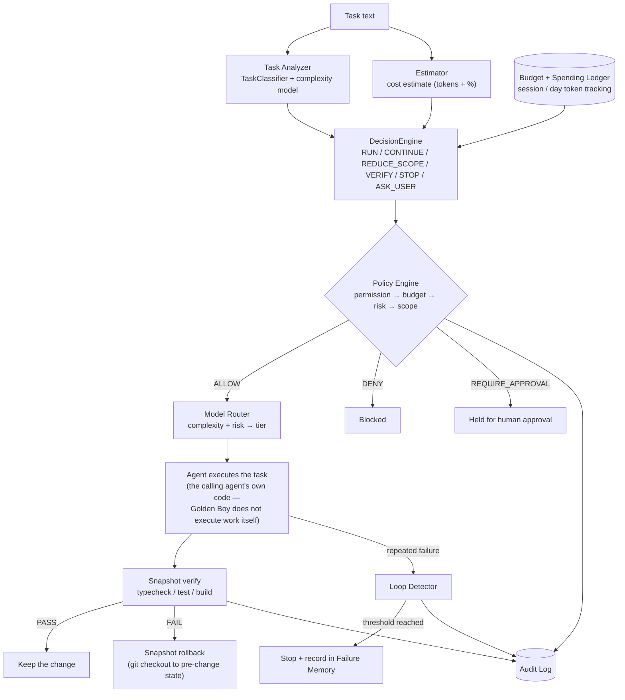
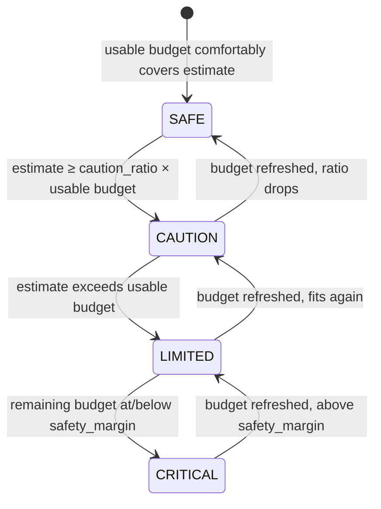
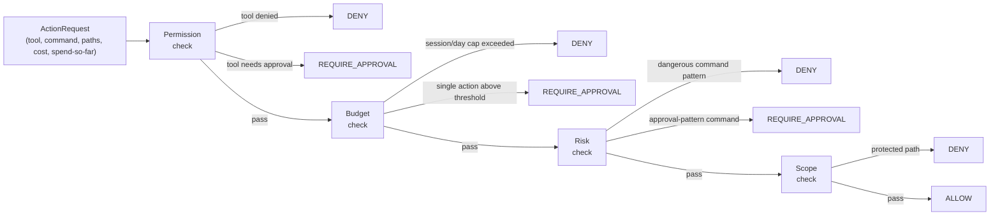

<p align="center">
  <b>English</b> | <a href="README_zh.md">中文</a> | <a href="README_ja.md">日本語</a> | <a href="README_ko.md">한국어</a> | <a href="README_ar.md">العربية</a> | <a href="README_es.md">Español</a>
</p>

<p align="center">
  
</p>

<h1 align="center">Golden Boy</h1>
<p align="center"><b>A budget-aware, policy-governed, verifiable runtime layer for AI coding agents.</b></p>

<p align="center">
  
  
  
  
  = 18">
  <a href="LICENSE"></a>
</p>

<p align="center">
  <a href="#overview">Overview</a> &nbsp;&middot;&nbsp;
  <a href="#why-golden-boy">Why</a> &nbsp;&middot;&nbsp;
  <a href="#architecture">Architecture</a> &nbsp;&middot;&nbsp;
  <a href="#policy-engine">Policy Engine</a> &nbsp;&middot;&nbsp;
  <a href="#model-routing">Model Routing</a> &nbsp;&middot;&nbsp;
  <a href="#checkpoint--recovery">Checkpoint &amp; Recovery</a> &nbsp;&middot;&nbsp;
  <a href="#loop-detection">Loop Detection</a> &nbsp;&middot;&nbsp;
  <a href="#auditability">Auditability</a> &nbsp;&middot;&nbsp;
  <a href="#protocol--integrations">Protocol &amp; SDKs</a> &nbsp;&middot;&nbsp;
  <a href="#installation">Install</a> &nbsp;&middot;&nbsp;
  <a href="#cli-usage">CLI</a> &nbsp;&middot;&nbsp;
  <a href="#limitations">Limitations</a> &nbsp;&middot;&nbsp;
  <a href="#roadmap">Roadmap</a>
</p>

> **Latest update (2026-09-18):** Golden Boy grows from a task-estimation tool into a governance layer —
> **Policy Engine**, a session/day **budget ledger**, a **Model Router**, an **Audit Log**, git-based
> **checkpoint/rollback**, **loop detection**, and **failure memory**. All additive: every command, config
> default, and public API that existed before this update behaves exactly as it did before. See
> [Design Inspiration](#design-inspiration) for what this does and does not borrow from autonomous-agent
> runtime research, and [`CHANGELOG.md`](CHANGELOG.md) for the full, itemized change list.

---

## Overview

AI coding agents are usually given a task and a lot of trust: run whatever commands you think you need,
edit whatever files, keep going until you're done or the money runs out. That works until it doesn't — an
agent runs a destructive command, edits a `.env` file, burns through a budget on one oversized task, retries
the same failing test forever, or simply stops mid-edit with no record of what happened.

**Golden Boy** is a local, dependency-free runtime layer that sits between an agent and its own actions. It
estimates what a task will cost *before* committing to it, checks that estimate against a real budget and
policy rules, decides whether the action should even be allowed to run, routes it to an appropriately
capable (not necessarily the most expensive) model tier, and — if the calling agent asks it to — checkpoints
the working tree first so a bad change can be rolled back instead of merged.

| | |
|---|---|
| ✅ **It does** | Classify a task, estimate its cost, track budget (as a percentage *and*, new in this update, as absolute session/day tokens), enforce policy (ALLOW / DENY / REQUIRE_APPROVAL) over tools/commands/paths/spend, route to a model tier, checkpoint and roll back working-tree changes via git, detect repeated failures, remember why past tasks failed, and log every governance decision to a local, human-readable audit trail. |
| 🚫 **It doesn't** | Execute arbitrary coding work itself, decompose a task into a coding plan, replace the calling agent's judgment, run a server/daemon, use a database, call an LLM to make a policy decision, or implement anything resembling a wallet, cryptocurrency, agent marketplace, or agent-replication economy. See [Design Principles](#design-principles) and [Limitations](#limitations). |

---

## Why Golden Boy?

The instinct when making an agent more capable is to give it more autonomy: more tools, longer runs, less
supervision. Golden Boy's premise is the opposite one — the thing worth building isn't *more autonomy*, it's
**autonomy that stays inside explicit constraints**:

```
autonomy
  + budget limits
  + permission limits
  + verification
  + recovery
  + auditability
```

Concretely, that means every one of the new capabilities in this update is a **hard, code-level check**, not
a prompt asking an LLM to please behave: `PolicyEngine.evaluate()` returns `ALLOW`/`DENY`/`REQUIRE_APPROVAL`
from deterministic rules over facts the caller already knows (the tool name, the command text, the file
paths, the estimated cost, the running spend) — never a model call, and never merely a warning the agent is
free to ignore.

---

## Core Concepts

| Concept | What it answers | Module |
|---|---|---|
| **Task Analyzer** | What kind of task is this, and how complex does it look? | `goldenboy.core.task_classifier`, `goldenboy.core.complexity` |
| **Budget Engine** | What will this cost, what's left, and is the estimate the same thing as the actual? | `goldenboy.core.estimator`, `goldenboy.core.budget`, `goldenboy.core.spending` |
| **Policy Engine** | Is this specific action allowed to run at all? | `goldenboy.core.governance` |
| **Model Router** | Given the task's complexity and the budget's risk level, which capability tier fits? | `goldenboy.core.router` |
| **Checkpoint / Recovery** | If this change breaks something, can we get back to before it? | `goldenboy.core.checkpoint` (task-plan), `goldenboy.core.snapshot` (working tree, git-based) |
| **Loop Detection** | Is the agent retrying the same failing thing forever? | `goldenboy.core.loop_detection` |
| **Failure Memory** | Has something like this failed before, and how was it resolved? | `goldenboy.core.failure_memory` |
| **Audit Log** | What actually happened, when, and why? | `goldenboy.core.audit` |

Every row above is an independently usable Python class *and* a `goldenboy` CLI subcommand — see
[CLI Usage](#cli-usage). None of them require the others to work.

---

## Architecture



This is the **recommended composition**, not something Golden Boy forces on its own: every box above is a
real, independently tested module and CLI command, but nothing here automatically wires them together into
one mandatory pipeline (see [Design Principles](#design-principles) for why — the short version is that
`AdaptiveExecutor`/`budget_aware_execution` are already stable, already tested, and stayed unchanged;
composing the new pieces is left to the caller, the same "wrap your own callable" shape those two already
use). A minimal integration only needs the boxes it actually wants — e.g. just the Policy Engine, or just
Snapshot verify/rollback.

<details>
<summary><b>How a risk mode (SAFE/CAUTION/LIMITED/CRITICAL) is decided</b></summary>



Pre-existing, unchanged logic (`goldenboy.core.risk.RiskEngine`) — shown here because the Model Router and
Policy Engine's budget check both build on it. A `STALE` or `UNKNOWN` usage reading can never quietly
produce `SAFE`; see [How It Works](#how-it-works).

</details>

---

## Budget-Aware Execution

Golden Boy has always tracked *remaining* budget as a percentage (`Budget`/`RiskEngine`) and, since the
2026-09-17 upgrade, distinguished *estimated* from *actual* cost per task
(`goldenboy report` → `goldenboy calibrate`). This update adds a third layer: **cumulative spend tracking
in absolute tokens**, scoped to a session or a calendar day, so a caller can enforce "no more than N tokens
today" — something a per-check percentage alone can't express.

```bash
$ goldenboy spend record --label "Task A" --estimated-tokens 20000 --actual-tokens 17000 --budget-limit 100000 --window all
Spending ledger (all) -- 1 entrie(s), 1 settled
  Estimated (sum of all entries): 20,000 tokens
  Actual (sum of settled entries): 17,000 tokens
  Committed (actual where known, else estimated): 17,000 tokens
  Budget limit: 100,000 tokens
  Remaining: 83,000 tokens

$ goldenboy spend record --label "Task B" --estimated-tokens 50000 --actual-tokens 56000 --budget-limit 100000 --window all
Spending ledger (all) -- 2 entrie(s), 2 settled
  Estimated (sum of all entries): 70,000 tokens
  Actual (sum of settled entries): 73,000 tokens
  Committed (actual where known, else estimated): 73,000 tokens
  Budget limit: 100,000 tokens
  Remaining: 27,000 tokens
```

That's the exact worked example from this project's own design brief, reproduced as real CLI output —
`27,000` remaining after two tasks whose estimates (20,000 / 50,000) turned out different from their
actuals (17,000 / 56,000). `LedgerSummary.committed_tokens` always uses the **actual** figure once one is
known, and falls back to the **estimate** only as a provisional hold — the two are never displayed as if
they were the same number. See [Cost Estimation](#cost-estimation) and [Budget Controls](#budget-controls).

---

## Policy Engine



Four checks, always in this order, first non-`ALLOW` wins — `goldenboy.core.governance.PolicyEngine`:

```bash
$ goldenboy policy bash --command "git push --force origin main" --estimated-cost-percentage 5
Verdict: DENY
Check:   risk
Reason:  Command matches a denied pattern ('\bgit\s+push\s+(--force|-f)\b[^|;&]*\b(origin\s+)?(main|master)\b').
Matched: \bgit\s+push\s+(--force|-f)\b[^|;&]*\b(origin\s+)?(main|master)\b

$ goldenboy policy bash --command "sudo systemctl restart app"
Verdict: REQUIRE_APPROVAL
Check:   risk
Reason:  Command matches a pattern requiring approval ('\bsudo\b').
```

`goldenboy policy` exits `0` on `ALLOW`, `1` on `DENY`, `2` on `REQUIRE_APPROVAL` — a calling script or agent
harness can branch on the exit code directly, not just parse text. Rules (denied/approval tools, denied/
approval command regex patterns, protected file-path globs, session/day cost caps, a single-action
approval threshold) live in `PolicyConfig`, loaded from `.goldenboy/policy.json` via the same
defaults → file → env-var cascade `GoldenBoyConfig` already uses — see [Configuration](#configuration).

Protected paths are denied by default (`.env`, `**/credentials*`, `**/*.pem`, `**/id_rsa*`, `**/.ssh/**`,
`**/.aws/**`, `**/.git/**`, …) — editing those requires an explicit policy override, not an agent's own
judgment call. See [Agent Safety](#agent-safety).

---

## Model Routing

`goldenboy.core.router.ModelRouter` maps two signals — task complexity (reused from `DecisionEngine`,
not reinvented) and budget risk (reused from `RiskEngine`) — to one of six **provider-neutral tiers**.
Budget risk can only pull the tier *down*, never push it up:

| Complexity → | Budget risk ↓ | Effective tier |
|---|---|---|
| any | `SAFE` | complexity's own tier (up to `HIGHEST`) |
| any | `CAUTION` | capped at `HIGH` |
| any | `LIMITED` | capped at `CHEAP` |
| any | `CRITICAL` | forced to `STOP` |

```bash
$ goldenboy route "Re-architect the data model and migrate the storage layer" --budget 12
--- Golden Boy Model Router: 'Re-architect the data model and migrate the storage layer' ---
Complexity:   HIGH -> tier 'high'
Budget risk:  CAUTION -> cap 'high'
Routed tier:  HIGH
Model:        (unconfigured — map tiers to real model names in .goldenboy/router.json)
Reason:       Complexity HIGH routes to 'high' (budget risk CAUTION does not constrain it further).
```

Golden Boy ships **no real model names or pricing data** — mapping a tier to an actual model identifier is
optional, caller-supplied config (`.goldenboy/router.json`'s `tier_models`). Unconfigured, `model_name` is
`None`, never a guess, and the router has no dependency on any specific AI provider.

---

## Checkpoint & Recovery

Two different, deliberately separately-named checkpoint systems exist — conflating them would have meant
either breaking the existing one's established CLI vocabulary or silently changing what "checkpoint" means:

| | `CheckpointManager` (pre-existing) | `SnapshotManager` (new) |
|---|---|---|
| Checkpoints | Golden Boy's own task-plan state (which `ExecutionUnit`s are done/deferred) | The working tree's file contents |
| CLI | `goldenboy status` / `goldenboy resume` | `goldenboy snapshot create` / `verify` / `rollback` / `list` |
| Storage | `.goldenboy/checkpoint.json` | git objects (`git stash create`) + `.goldenboy/snapshots.jsonl` |

`SnapshotManager` uses **git itself**, not a second version-control system:

```bash
$ goldenboy snapshot create --label "before refactor"
Snapshot 1a0b4572834 created (clean tree) at HEAD 0e35080f0696.

$ echo "print('broken'" >> goldenboy/app.py   # a syntax error, for the example

$ goldenboy snapshot verify --check "python3 -c \"import ast; ast.parse(open('goldenboy/app.py').read())\"" --rollback-on-fail
Verification: FAIL
  [FAIL] python3 -c "import ast; ast.parse(open('goldenboy/app.py').read())" (0.04s)
Rolled back to snapshot 1a0b4572834.
```

`create()` records the current commit plus a `git stash create` object — this **touches nothing**: not the
working tree, not the index, not the stash list (it's git's plumbing form, not `git stash push`). `verify()`
runs whatever typecheck/test/build commands you give it, in order, stopping at the first failure — Golden
Boy has no opinion on what "test" means for your project. `rollback()` restores tracked-file content via
`git checkout <sha> -- .`, the least destructive form (moves no ref, touches only the working tree).

**Known limitation, stated plainly:** a file that was *untracked* at snapshot time, or created *after* it,
is not restored or removed by rollback — only tracked-file content is covered. See
[Limitations](#limitations).

---

## Loop Detection

An agent retrying the same failing action forever is a real, common failure mode. `LoopDetector` persists a
count per `(tool, args, error)` signature across separate `goldenboy` invocations (the CLI itself is
stateless per process, so this lives in `.goldenboy/loop_state.json`):

```bash
$ goldenboy loop record --tool pytest --args "test_login.py::test_expired_token" --error "AssertionError"
Signature 0a2ab6a808414a42 (pytest): 1/3
Continue: 1 of 3 allowed repeat(s) so far.

$ goldenboy loop record --tool pytest --args "test_login.py::test_expired_token" --error "AssertionError"
Signature 0a2ab6a808414a42 (pytest): 2/3
Continue: 2 of 3 allowed repeat(s) so far.

$ goldenboy loop record --tool pytest --args "test_login.py::test_expired_token" --error "AssertionError"
Signature 0a2ab6a808414a42 (pytest): 3/3
Stop retrying: the same (tool, args, error) signature has repeated 3 time(s), at or above the threshold of
3. Save state and report the failure rather than retrying again.
```

The third call exits `1` — `should_stop` is `True`. Threshold is `GoldenBoyConfig.loop_repeat_threshold`
(default `3`), the same range-validated, env-overridable config pattern every other threshold in this
project uses. Only a hash of the signature is persisted, not the raw arguments/error text — same privacy
convention as `HistoryStore.TaskEvent.prompt_hash`.

A related, minimal module — `goldenboy.core.failure_memory` / `goldenboy failure` — records *why* a task
failed (a normalized, hashed cause summary, so "line 42 failed" and "line 57 failed" count as the same
underlying failure), so a later task can check "has this happened before" via keyword-overlap similarity —
no vector database, no embeddings, per this project's "start simple" principle:

```bash
$ goldenboy failure similar --cause "connection timeout calling the billing API"
[0.83] 3f1c9a2b1e4d5678  attempts=2  connection timeout while calling the payments API
```

---

## Auditability

Every Policy Engine decision, when given an `AuditStore`, is written to a local, human-readable,
append-only log — `goldenboy.core.audit`:

```bash
$ goldenboy audit
[11:46:45]
ACTION: policy_check
TOOL: bash
POLICY: deny (DANGEROUS_COMMAND)
ESTIMATED: 0 tokens
RESULT: blocked
```

This is the exact block format from the project's own design brief. `error`/`extra` free-text fields pass
through `goldenboy.core.redaction.redact_secrets` first — a pattern-based mask for common credential shapes
(API keys, bearer tokens, `key=value` assignments) — before anything reaches disk; see
[Agent Safety](#agent-safety) and [`SECURITY.md`](SECURITY.md). Nothing here is a placeholder: `goldenboy
audit --json` returns the same structured entries a dashboard or log aggregator would ingest, today, from a
fresh install with no setup beyond running `goldenboy policy ... --audit`.

---

## How It Works

The pre-existing task-intelligence pipeline (unchanged by this update):

```
Task text
  │
  ├──► TaskClassifier        ──► TaskType (+ secondary types)
  ├──► Complexity model      ──► complexity score + named signals
  └──► Context relevance     ──► which repo files this task text
       (Estimator)                actually points at (not repo size)
                                     │
                                     ▼
                              Cost Estimate
                                     │
                                     ▼
                          Budget × Confidence
                     (EXACT · ESTIMATED · STALE · UNKNOWN)
                                     │
                 ┌───────────┬───────┴───────┬───────────┐
                 ▼           ▼               ▼           ▼
               SAFE      CAUTION         LIMITED     CRITICAL
                                     │
                                     ▼
                     Decision (RUN / CONTINUE / REDUCE_SCOPE /
                        FINISH / VERIFY / STOP / ASK_USER)
```

| Mode | Meaning | Agent behavior |
|---|---|---|
| 🟢 `SAFE` | Comfortably above estimated cost | Execute normally |
| 🟡 `CAUTION` | Sufficient, but a large share of budget | Keep going, avoid opening new scope |
| 🟠 `LIMITED` | Estimated cost exceeds usable budget | Constrain to P0/P1, say what's skipped |
| 🔴 `CRITICAL` | Budget already at/below its safety margin | Finish current unit, checkpoint, stop |

A `STALE` budget reading is never allowed to produce `SAFE` — it's upgraded to at least `CAUTION`;
`DecisionEngine` applies the same conservative rule to `UNKNOWN`-confidence budgets. See
[`goldenboy/core/risk.py`](goldenboy/core/risk.py) / [`goldenboy/core/decision_engine.py`](goldenboy/core/decision_engine.py).

---

## Protocol & Integrations

Every decision Golden Boy produces — from Python, the CLI, or TypeScript — is one versioned,
language-neutral JSON shape: the **Golden Boy Protocol** (unchanged by this update; full schema and
versioning policy in [`docs/PROTOCOL.md`](docs/PROTOCOL.md)).

```bash
$ goldenboy analyze "Refactor the auth module" --budget 6 --json
```
```jsonc
{
  "schema_version": "1.1.0",
  "task": { "task_type": "refactor", "complexity_label": "LOW", "estimated_cost_percentage": 5.0, "...": "..." },
  "usage": { "remaining_percentage": 6.0, "confidence": "EXACT", "...": "..." },
  "risk": { "mode": "LIMITED", "reason_code": "ESTIMATED_COST_EXCEEDS_USABLE_BUDGET" },
  "action": "reduce_scope",
  "confidence": 0.832,
  "reason": "Task classified as refactor (LOW complexity, ...). Recommended action: REDUCE_SCOPE.",
  "recommendation": ["Constrain remaining work to P0/P1 items.", "Explicitly defer P2-P4 items and say so."]
}
```

```python
from goldenboy import AdaptiveExecutor, MockProvider, budget_aware_execution, Priority

provider = MockProvider(initial_percentage=40.0)

@budget_aware_execution(provider, "1", "Refactor the auth module", Priority.P1)
def refactor_auth():
    ...  # your real work goes here — Golden Boy decides whether to call it at all
```

```ts
import { GoldenBoyClient } from "@goldenboy/sdk";

const client = new GoldenBoyClient(); // uses `goldenboy` from PATH — a thin client, not a reimplementation
const decision = await client.analyze("Refactor the authentication system", { budget: 6 });
console.log(decision.action, decision.confidence);
```

[`sdk/typescript`](sdk/typescript) spawns the real `goldenboy` CLI and validates its `--json` output through
the same protocol contract — zero runtime dependencies of its own, 21 tests including real (non-mocked)
integration tests against the actual CLI. Unchanged and re-verified passing against this update's build.

| Provider | Reads | Notes |
|---|---|---|
| `MockProvider` | A synthetic, in-memory percentage | For demos and tests — no network calls. |
| `AnthropicAdapter` | `anthropic-ratelimit-tokens-remaining` / `-limit` response headers | Requires `goldenboy[anthropic]`. Org-wide shared limit, not this call alone. |
| `OpenAIAdapter` | `x-ratelimit-remaining-tokens` / `-limit-tokens` response headers | Requires `goldenboy[openai]`. Same shared-limit caveat. |
| Claude Code skill | The `<total_tokens>` figure Claude Code injects into context | [`skills/goldenboy/SKILL.md`](skills/goldenboy/SKILL.md) — prompt-level, no Python process required. |

---

## History, Backtesting & Calibration

Every `budget_aware_execution`-decorated call appends one event to a local, append-only log
(`.goldenboy/history.jsonl`) — never the task's raw text, only its length and a truncated hash.
`goldenboy validate` reports a real Dataset Quality report (`NO_DATA` on a fresh install, honestly, not a
fabricated baseline); `goldenboy replay` backtests five resource-allocation policies (two fixed-threshold
baselines, complexity-only, usage-only, and `GoldenBoyPolicy` wrapping the real `RiskEngine`) against that
history, reporting `N/A` below 10 events rather than inventing a table.

`goldenboy report` closes the estimate → execute → observe loop: record what an external agent actually
measured after acting on a `goldenboy analyze` decision, echoing back the estimate it's compared against.
`goldenboy calibrate` then reports MAE/RMSE/bias between estimated and actual cost, overall and per task
type — `N/A`, insufficient-data below 10 telemetry records, same honesty convention as `replay`. None of
this is changed by this update; the new session/day spending ledger (see
[Budget-Aware Execution](#budget-aware-execution)) is a separate, additive layer on top, not a replacement.

---

## Installation

```bash
pip install goldenboy
goldenboy --help
```

Or from source:

```bash
git clone https://github.com/amuldi/GoldenBoy.git
cd GoldenBoy
pip install -e .
```

The core install has **no required third-party dependencies**. Optional extras add specific capabilities:

```bash
pip install "goldenboy[tiktoken]"   # exact token counts (falls back to a coarser heuristic without it)
pip install "goldenboy[anthropic]"  # AnthropicAdapter
pip install "goldenboy[openai]"     # OpenAIAdapter
```

`goldenboy snapshot` additionally requires `git` on `PATH` (invoked via `subprocess`, never a shell string
— see [`SECURITY.md`](SECURITY.md)); every other command works with the core install alone.

TypeScript agents/tools can use [`sdk/typescript`](sdk/typescript) instead of calling the CLI directly.

---

## Quick Start

```bash
goldenboy analyze "Refactor the authentication system"     # full recommendation: type, risk, action, why
goldenboy policy bash --command "rm -rf /"                 # code-enforced ALLOW/DENY/REQUIRE_APPROVAL
goldenboy route "Refactor the authentication system"        # provider-neutral model tier
goldenboy spend record --label "Task A" --estimated-tokens 20000 --budget-limit 100000
goldenboy status                                             # current budget and any pending checkpoint
goldenboy validate                                            # config + checkpoint + local data-quality report
goldenboy doctor                                               # environment, config, and checkpoint diagnostics
```

---

## CLI Usage

**Task intelligence & budget (pre-existing):**

| Command | Purpose |
|---|---|
| `goldenboy analyze <task>` | Full recommendation: type, complexity, risk, action, confidence, reason. `--progress`, `--json`. |
| `goldenboy plan <task>` | Estimate a task's cost from its text + relevant repo context, show the risk mode. |
| `goldenboy run <task>` | Execute a budget-aware demo plan adaptively against a mock budget. |
| `goldenboy status` | Inspect current budget and any pending task-plan checkpoint. `--json`. |
| `goldenboy resume` | Resume execution from the previous task-plan checkpoint. |
| `goldenboy doctor` | Diagnose Python version, optional deps, provider keys, config, checkpoint. `--json`. |
| `goldenboy validate` | Validate config + checkpoint + local history data quality; exits 1 on a real problem. `--json`. |
| `goldenboy replay` | Backtest baseline policies against local (or `--dataset PATH`) history. `--json`. |
| `goldenboy report` | Record actual execution telemetry for a task previously analyzed. `--outcome` + optional fields, or `--json-file`. |
| `goldenboy calibrate` | Compare estimated vs. actual cost (MAE/RMSE/bias) over recorded telemetry. `--dataset`, `--json`. |
| `goldenboy benchmark` | Measure estimator/risk/policy/router/audit/CLI-startup latency, now, on this machine. `--json`. |
| `goldenboy export` | Export config + checkpoint + history as one reproducible JSON document. `--output`. |

**Governance & runtime safety (new in this update):**

| Command | Purpose |
|---|---|
| `goldenboy policy <tool>` | Evaluate one action: `ALLOW`(exit 0) / `DENY`(exit 1) / `REQUIRE_APPROVAL`(exit 2). `--command`, `--path` (repeatable), `--estimated-cost-percentage`, `--session-calls`, `--session-spent-percentage`, `--day-spent-percentage`, `--policy-file`, `--audit`, `--json`. |
| `goldenboy route <task>` | Map task complexity + budget risk to a provider-neutral model tier. `--budget`, `--router-file`, `--json`. |
| `goldenboy audit` | Show recent Audit Log entries. `--limit`, `--json`. |
| `goldenboy spend <action>` | `record` / `status` / `reset-session` — session/day token-spend ledger. `--label`, `--estimated-tokens`, `--actual-tokens`, `--budget-limit`, `--window {session,daily,all}`, `--json`. |
| `goldenboy snapshot <action>` | `create` / `verify` / `rollback` / `list` — git-based working-tree checkpoint. `--label`, `--check` (repeatable), `--rollback-on-fail`, `--id`, `--json`. |
| `goldenboy loop <action>` | `record` / `status` / `reset` — repeated-failure detection. `--tool`, `--args`, `--error`, `--threshold`, `--json`. |
| `goldenboy failure <action>` | `record` / `list` / `resolve` / `similar` — minimal failure memory. `--cause`, `--task-type`, `--signature`, `--resolution`, `--min-similarity`, `--json`. |
| `goldenboy heartbeat` | **Experimental.** Cheap, local-only "does anything need attention" check. `--budget`, `--previous-budget`, `--json`. |

Add `--budget` to any mock-budget command to control the starting budget, and `-v`/`--verbose` (before the
subcommand) for the internal per-unit decision log.

---

## Configuration

Every policy threshold lives in a config dataclass, with the same override order throughout:

```
explicit constructor arg  >  GOLDENBOY_* environment variable  >  .goldenboy/*.json file  >  default
```

**`GoldenBoyConfig`** (`.goldenboy/config.json`):

| Field | Env var | Default | Meaning |
|---|---|---|---|
| `safety_margin` | `GOLDENBOY_SAFETY_MARGIN` | `3.0` | Percentage points reserved below remaining budget before it counts as exhausted. |
| `caution_ratio` | `GOLDENBOY_CAUTION_RATIO` | `0.5` | Estimated-cost/usable-budget ratio at which risk moves from SAFE to CAUTION. |
| `base_cost_per_unit` | `GOLDENBOY_BASE_COST_PER_UNIT` | `2.0` | Fallback per-unit cost when a plan's units don't declare one. |
| `max_budget_tokens` | `GOLDENBOY_MAX_BUDGET_TOKENS` | `100000` | Token count treated as "100% of budget" for percentage conversion. |
| `stale_after_seconds` | `GOLDENBOY_STALE_AFTER_SECONDS` | `300.0` | How long a refreshed provider reading stays `ESTIMATED` before aging to `STALE`. |
| `loop_repeat_threshold` | `GOLDENBOY_LOOP_REPEAT_THRESHOLD` | `3` | Repeats of the same signature before `LoopDetector` recommends stopping. |

**`PolicyConfig`** (`.goldenboy/policy.json`, list fields are wholesale-replaced by a file, not merged):

| Field | Default |
|---|---|
| `denied_tools` / `approval_required_tools` | `[]` / `[]` |
| `denied_command_patterns` | `rm -rf /`, fork bombs, `DROP TABLE`/`DATABASE`, `chmod -R 777 /`, `git push --force` to `main`/`master`, `git branch -D main/master`, … |
| `approval_command_patterns` | `git push`, `git reset --hard`, `git clean -f`, `npm publish`, `sudo`, `pip install --upgrade`, `curl \| sh`, … |
| `protected_path_patterns` | `.env*`, `**/credentials*`, `**/*secret*`, `**/*.pem`, `**/id_rsa*`, `**/.ssh/**`, `**/.aws/**`, `**/.git/**` |
| `max_calls_per_session_per_tool` | `50` |
| `session_budget_limit_percentage` / `day_budget_limit_percentage` | `None` (disabled) |
| `max_single_action_cost_percentage` | `40.0` |

**`RouterConfig`** (`.goldenboy/router.json`): `tier_models` — an optional `{tier: real-model-name}`
mapping, empty by default (see [Model Routing](#model-routing)).

Out-of-range values, malformed JSON, invalid regex patterns, and unparseable `GOLDENBOY_*` env vars all
raise a clear, typed error — never a stack trace.

---

## Examples

A full arc: analyze, then govern with policy, then route, then checkpoint-verify-rollback:

<details>
<summary><b>$ goldenboy analyze "Refactor the authentication system and update tests" --budget 6</b></summary>

```
--- Golden Boy Analysis: 'Refactor the authentication system and update tests' ---
Task type:        refactor (confidence: 0.47)
Also detected:    testing, architecture_change
Complexity:       LOW (0.20)
Complexity signals: test_requirement_keyword, refactor_keyword
Estimated cost:   29.42% (confidence: 0.85)
Remaining usage:  6.00% (exact, source: mock)
Risk:             LIMITED (ESTIMATED_COST_EXCEEDS_USABLE_BUDGET)
Decision:         REDUCE_SCOPE (confidence: 0.77)
Reason:           Task classified as refactor (LOW complexity, estimated cost 29.4% of budget, confidence 0.85). Remaining budget is 6.0% (exact via mock). Risk mode: LIMITED. Recommended action: REDUCE_SCOPE.
Recommendation:
  - Constrain remaining work to P0/P1 items.
  - Explicitly defer P2-P4 items and say so.
```

</details>

<details>
<summary><b>$ goldenboy heartbeat --budget 2 --previous-budget 20</b> (experimental)</summary>

```
Should wake: True
  - Budget is exhausted (at or below its safety margin).
  - Budget changed since last check: 20.0% -> 2.0%.
  - Loop detection recorded 1 signature(s) at/above threshold (tool(s): pytest).
```

Three cheap, local, no-LLM-call checks combined into one answer — see [Limitations](#limitations) for what
this is and isn't a guarantee of.

</details>

<details>
<summary><b>$ goldenboy validate</b> (fresh install, no history yet)</summary>

```
--- Golden Boy Validate ---
Config:     OK — safety_margin=3.0, caution_ratio=0.5, base_cost_per_unit=2.0, max_budget_tokens=100000, stale_after_seconds=300.0
Checkpoint: OK — none present

Dataset Quality
Rows:                 0
Status: NO_DATA — insufficient validated data (no history recorded yet).
```

No numbers are invented to fill in for data that doesn't exist yet.

</details>

---

## Cost Estimation

`Estimator.estimate_task()` scores four independent terms — relevant repo context (which files the task's
*own wording* points at, not whole-repository size), prompt tokens, expected output tokens (scaled by an
independent complexity signal), and verification overhead — into one percentage, with a reported confidence
that drops when there's no file-path evidence to ground the estimate. Full mechanism, weights, and the P0
accuracy fix that decoupled this from repo size: [`ARCHITECTURE_AUDIT.md`](ARCHITECTURE_AUDIT.md) §7 and
`CHANGELOG.md`'s 2026-09-17 entry. This update does not change `Estimator` itself — it adds the session/day
**ledger** on top (see [Budget-Aware Execution](#budget-aware-execution)) and the **estimated vs. actual**
distinction that ledger enforces everywhere it's displayed.

---

## Budget Controls

Budget is enforced, not just displayed, at two layers:

1. **Per-request** (`RiskEngine`, unchanged): does *this* estimated cost fit the *current* usable budget?
2. **Cumulative** (new — Policy Engine's budget check + the spending ledger): does this request, added to
   what's already been spent this session/day, stay under an explicit cap? `goldenboy spend` enforces the
   cap directly (`over_limit` → exit `1`); `goldenboy policy`'s budget check enforces the same idea per
   action, plus a hard per-tool session call limit and a soft single-action-cost approval threshold.

No silent degradation: a request that doesn't fit is `DENY`d or flagged `REQUIRE_APPROVAL`, never quietly
allowed through with an inflated confidence.

---

## Agent Safety

The Policy Engine's **scope** check exists specifically so an agent's own judgment isn't the only thing
standing between it and a `.env` file, an SSH key, or `.git/` internals — those paths are denied by default,
not left to a prompt instruction. The **risk** check does the same for shell commands: `rm -rf /`, fork
bombs, `DROP TABLE`, `chmod -R 777 /`, and force-pushing `main`/`master` are denied outright; `sudo`,
`git push`, `git reset --hard`, and `npm publish` require approval. Combined with **loop detection** (stop
retrying, don't spin forever) and **snapshot rollback** (a bad change is reversible, not merged by default),
the safety story is: an agent can be wrong, and the blast radius of being wrong stays bounded.

None of this replaces human review for anything genuinely consequential — `REQUIRE_APPROVAL` exists
precisely to keep a human in that loop, not to simulate one.

---

## Project Structure

<details>
<summary><b>Click to expand the package tree</b></summary>

```
goldenboy/
├── __init__.py              # small, deliberate public API
├── cli.py                    # 20 subcommands — see CLI Usage above
├── protocol.py                 # the Golden Boy Protocol -- GoldenBoyDecision schema + validation
├── integration.py               # budget_aware_execution decorator + history recording
├── adapters/
│   ├── base.py                    # ProviderAdapter interface + shared staleness logic
│   ├── mock.py                     # synthetic provider for demos/tests
│   ├── anthropic_adapter.py
│   └── openai_adapter.py
├── core/
│   ├── budget.py                     # Budget, UsageConfidence
│   ├── estimator.py                   # task cost estimation
│   ├── risk.py                         # RiskEngine → ExecutionMode
│   ├── executor.py                     # AdaptiveExecutor
│   ├── checkpoint.py                    # CheckpointManager (task-plan checkpoint)
│   ├── config.py                         # GoldenBoyConfig
│   ├── priorities.py                      # Priority, ExecutionUnit
│   ├── task_types.py                       # TaskType, DecisionAction vocabularies
│   ├── task_classifier.py                   # TaskClassifier -- deterministic keyword classification
│   ├── complexity.py                         # independent task-complexity signal model
│   ├── decision_engine.py                     # DecisionEngine -- the full explained GoldenBoyDecision
│   ├── history.py                              # HistoryStore, TaskEvent -- local event log
│   ├── telemetry.py                             # ExecutionTelemetry, TelemetryStore
│   ├── calibration.py                            # estimated-vs-actual MAE/RMSE/bias
│   ├── policies.py                                # baseline policies + GoldenBoyPolicy, for replay
│   ├── governance.py            # NEW — Policy Engine (ALLOW/DENY/REQUIRE_APPROVAL)
│   ├── spending.py               # NEW — session/day token-spend ledger
│   ├── router.py                  # NEW — Model Router (complexity + risk → tier)
│   ├── audit.py                    # NEW — Audit Log
│   ├── redaction.py                 # NEW — secret redaction for audit/failure-memory free-text
│   ├── snapshot.py                   # NEW — git-based working-tree checkpoint/verify/rollback
│   ├── loop_detection.py              # NEW — repeated-failure detection
│   ├── failure_memory.py               # NEW — minimal failure-cause memory
│   ├── heartbeat.py                     # NEW — experimental cheap local "needs attention" check
│   ├── benchmark.py                      # shared benchmark implementation (CLI + scripts/benchmark.py)
│   └── errors.py                          # GoldenBoyError and all typed subclasses
├── analytics/
│   ├── data_quality.py         # Dataset Quality report over the local history log
│   └── engine.py                 # cost/completion/failure-rate aggregates
└── replay/
    └── engine.py               # run_backtest, walk_forward_folds

sdk/typescript/               # thin TypeScript client -- unchanged by this update
docs/                          # PROTOCOL.md, DATASETS.md, LANGUAGE_STRATEGY.md
```

</details>

---

## Development

```bash
git clone https://github.com/amuldi/GoldenBoy.git
cd GoldenBoy
python -m venv .venv
source .venv/bin/activate
pip install -e ".[dev]"

pytest --cov=goldenboy --cov-report=term-missing
ruff check goldenboy tests scripts run_tests.py
mypy
python -m build
```

For the TypeScript SDK:

```bash
cd sdk/typescript
npm install
npm run typecheck && npm run build && npm test
```

---

## Testing

- **403 Python tests** (`pytest`), **94% line coverage** — up from 247 tests / 95% before this update; 156
  new tests cover the nine new modules and their CLI commands (`tests/test_governance.py`,
  `test_spending.py`, `test_router.py`, `test_audit.py`, `test_redaction.py`, `test_loop_detection.py`,
  `test_failure_memory.py`, `test_snapshot.py`, `test_heartbeat.py`, `test_cli_governance.py`).
- **21 TypeScript tests** (`sdk/typescript`, unaffected by this update), including real integration tests
  against the actual installed CLI — re-run and confirmed passing against this update's built wheel.
- Ruff and mypy clean; `python -m build` produces an installable wheel whose every CLI command (old and
  new) was exercised end-to-end against a fresh virtual environment.
- Policy: allowed action → `ALLOW`; denied tool → `DENY`; approval-required action → `REQUIRE_APPROVAL`;
  budget-exceeding request → `DENY`; dangerous command → `DENY` — all covered explicitly.
- Loop detection: same failure repeated → count increments; threshold reached → `should_stop`; distinct
  tool/args/error → distinct signature (no false-positive collapsing).
- Snapshot: verification pass → kept; verification failure → `rollback()` restores pre-change content
  (asserted on the actual file bytes, not just a return code).
- Audit: policy decisions recorded automatically when wired; secrets in `error`/`extra` fields redacted
  before the write, verified by reading the raw persisted file back, not just the in-memory object.

---

## Benchmarking

Measured locally (Apple M1 Pro, macOS arm64, Python 3.13.7) via `goldenboy benchmark` / `scripts/
benchmark.py` — one shared implementation, not part of CI's pass/fail gate, not a guarantee. Re-run it
yourself before relying on these numbers.

| Operation | Mean | Median | n |
|---|---|---|---|
| `Estimator.estimate_task()` (warm, this repo) | 61.22ms | 60.54ms | 20 |
| `RiskEngine.assess()` | <0.001ms | <0.001ms | 1000 |
| `PolicyEngine.evaluate()` | 0.007ms | 0.007ms | 200 |
| `ModelRouter.route()` | 0.002ms | 0.002ms | 200 |
| `AuditStore.record()` (local disk write) | 0.065ms | 0.056ms | 200 |
| CLI cold start (`goldenboy status`) | 143.75ms | 142.52ms | 5 |

`PolicyEngine`/`ModelRouter` are pure in-memory logic over already-known inputs — like `RiskEngine`, they're
sub-microsecond-to-low-microsecond by construction, not a bottleneck. `AuditStore.record()` is the one new
operation that touches disk (one JSONL line) and is still a fraction of a millisecond. Full methodology,
the estimator/CLI-startup numbers' history, and an honest note on this run's machine load:
[`BENCHMARKS.md`](BENCHMARKS.md).

---

## Design Principles

- **Existing architecture first** — nothing shipped in this update renamed, restructured, or changed the
  behavior of a pre-existing public API, CLI command, or config default. `goldenboy.core.governance`
  (new Policy Engine) is deliberately named apart from `goldenboy.core.policies` (pre-existing replay
  baselines) specifically to avoid colliding with that established, unrelated concept.
- **Code-enforced, not prompt-enforced** — every governance decision (`ALLOW`/`DENY`/`REQUIRE_APPROVAL`,
  loop-stop, rollback-on-fail) is a deterministic function over known inputs. None of it asks an LLM to
  decide, and none of it is a warning an agent is free to ignore.
- **Composable, not monolithic** — the [Architecture](#architecture) diagram is a recommendation, not
  something wired together automatically inside `AdaptiveExecutor`/`budget_aware_execution`, which remain
  unchanged. Use only the piece you need.
- **Honest confidence** — an estimate is never displayed as an actual; an unconfigured Model Router tier
  is `None`, never a guessed model name; a fresh install's audit/failure/loop state is genuinely empty, not
  backfilled with placeholder data.
- **No fabricated numbers** — every figure in this README (test counts, coverage, benchmark timings) was
  measured while writing it; see [Testing](#testing) and [Benchmarking](#benchmarking).
- **Minimal dependency surface** — the core install still has zero required third-party runtime
  dependencies; `goldenboy snapshot` needs `git` (already required by any project this feature targets),
  nothing new needs a database, a queue, or a network service.

---

## Design Inspiration

Golden Boy incorporates selected design concepts from autonomous-agent-runtime research — policy
enforcement, budget-aware execution, model routing, checkpoints, loop detection, failure memory, and
execution auditing — adapted specifically to Golden Boy's own stated purpose: **controlling AI task cost
and execution behavior**, not building a general autonomous-agent platform.

Golden Boy is **not a fork** of any such project, and does not implement — in any form, anywhere in this
codebase — a wallet, cryptocurrency (USDC or otherwise), an x402/ERC-8004-style payment or identity
protocol, an agent marketplace, an agent-to-agent social network, agent replication/spawning, a
self-funded-AI-business model, or autonomous trading. None of these has any connection to Golden Boy's
purpose; see `ROADMAP.md`'s "Explicit non-goals" for that stated in full, and as a checkable claim rather
than an assumption.

---

## Limitations

- Cost estimates are heuristic (prompt length + a bounded, keyword-matched scan of relevant repo files +
  an expected-output multiplier) — not billing guarantees.
- `TaskClassifier`/complexity scoring are deterministic keyword matchers, not trained models; a confidence
  score reflects match strength, not a calibrated probability.
- The Policy Engine's command/path rules are regex- and glob-based, not semantic — a command that achieves
  the same destructive effect through different wording can evade a specific pattern; the default rule set
  is a reasonable starting point, not an exhaustive one, and is meant to be extended via
  `.goldenboy/policy.json` for your own environment.
- `goldenboy.core.snapshot` rollback does not restore/remove files that were untracked at snapshot time or
  created after it — only tracked-file content is covered (see [Checkpoint & Recovery](#checkpoint--recovery)).
- Loop detection and failure memory are per-machine, local state (`.goldenboy/`) — they don't share
  knowledge across machines or CI runs unless you deliberately sync that directory.
- `failure_memory.find_similar()` is keyword-overlap (Jaccard) similarity, not semantic search — it will
  miss failures described in very different words even if the underlying cause is the same.
- `goldenboy heartbeat` is **experimental**: a reasonable starting set of cheap local checks (pending
  checkpoint, exhausted/changed budget, a loop-detection stop), not a completeness guarantee, and
  explicitly not a background daemon — Golden Boy still does not run a server or scheduler of its own; a
  caller's own scheduler decides when to invoke it.
- None of the new governance modules are automatically wired into `AdaptiveExecutor`/
  `budget_aware_execution` — composing them is the integrator's responsibility (see
  [Design Principles](#design-principles)).
- `goldenboy replay`/`goldenboy.analytics`/`goldenboy calibrate` still report `N/A`/`NO_DATA` until at
  least 10 real events/telemetry records exist locally — unchanged by this update.
- Golden Boy does not replace the calling agent's own judgment or a human reviewer's — `REQUIRE_APPROVAL`
  exists to keep a human in the loop for consequential actions, not to simulate one.

---

## Roadmap

**Shipped, tested, real (this update, 2026-09-18):** Policy Engine · session/day budget ledger · Model
Router · Audit Log · secret redaction · git-based snapshot/verify/rollback · loop detection · failure
memory · Heartbeat (experimental).

**Shipped, tested, real (prior):** task-aware cost estimation from relevant repo context, adaptive
execution modes, checkpoint/defer/resume, usage confidence incl. STALE detection, the Golden Boy Protocol
+ TypeScript SDK, task classification + `DecisionEngine`, local history + analytics, baseline-policy
backtesting, execution telemetry + calibration.

| Direction | Status |
|---|---|
| Deep automatic wiring of the Policy Engine/Audit Log into `AdaptiveExecutor`/`budget_aware_execution` | Explicit non-goal for now — see [Design Principles](#design-principles) |
| A real, populated backtest/calibration result (not `N/A`) | Blocked on real usage data accumulating locally |
| A learned task classifier, policy, or loop/failure-similarity model | Research — needs real labeled outcome data first, same "deterministic baseline first" gate the pre-existing `TaskClassifier` already follows |
| Cross-platform CI (macOS/Windows smoke tests) | Planned |
| Any wallet/cryptocurrency/agent-marketplace/agent-replication feature | **Not planned** — see [Design Inspiration](#design-inspiration) |

Full Done/Planned/Research breakdown, including every explicit non-goal, in [`ROADMAP.md`](ROADMAP.md).

---

## Contributing

Contributions are welcome. [`CONTRIBUTING.md`](CONTRIBUTING.md) has the setup steps, the checks a PR is
expected to pass (`pytest`, `ruff`, `mypy`, `python -m build` — all enforced in CI), and the engineering
principles review is held to: existing architecture first, root cause over symptom, no fake completeness,
honest confidence labeling, and no hardcoded policy numbers outside a config dataclass.

---

## More Docs

| Doc | Covers |
|---|---|
| [`SECURITY.md`](SECURITY.md) | Every `.goldenboy/*` file's contents, secret redaction, subprocess usage, and how to report a vulnerability. |
| [`docs/PROTOCOL.md`](docs/PROTOCOL.md) | The Golden Boy Protocol schema, versioning policy, and why there's no server. |
| [`docs/DATASETS.md`](docs/DATASETS.md) | Dataset/research landscape review and why none of them substitute for `HistoryStore`. |
| [`docs/LANGUAGE_STRATEGY.md`](docs/LANGUAGE_STRATEGY.md) | Why Python remains the core, where TypeScript is used, and the Rust migration boundary. |
| [`CHANGELOG.md`](CHANGELOG.md) | What changed, release to release — see the 2026-09-18 entry for this update in full. |
| [`ROADMAP.md`](ROADMAP.md) | Full Done / Planned / Research breakdown, including explicit non-goals. |
| [`BENCHMARKS.md`](BENCHMARKS.md) | Measured performance numbers, methodology, and machine-load caveats. |
| [`CONTRIBUTING.md`](CONTRIBUTING.md) | Setup, checks, and the engineering principles reviews are held to. |
| [`sdk/typescript/README.md`](sdk/typescript/README.md) | TypeScript SDK API reference and design notes. |

---

## License

[MIT](LICENSE).

<p align="center">
  ⭐ If Golden Boy keeps your agent inside its budget and off your <code>.env</code> file, a star helps more people find it.
</p>
